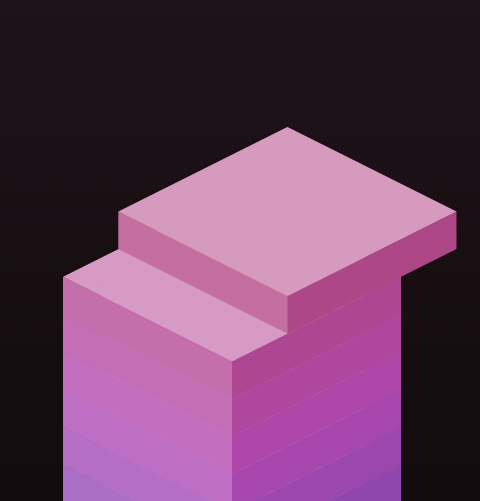
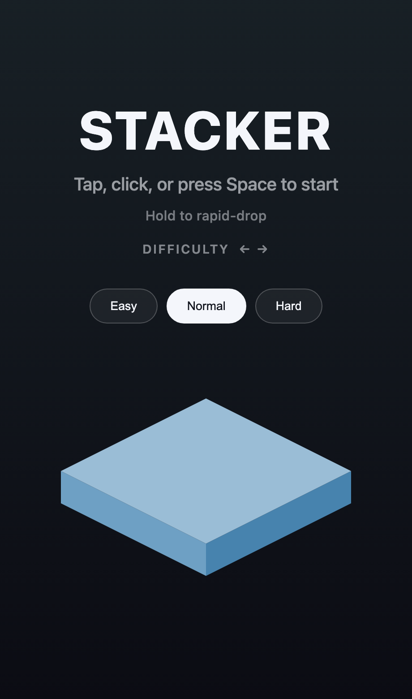

# Stacker

> Stack the blocks, nail the perfect drop, build the tallest tower you can — a tiny, addictive arcade game that runs entirely in your browser.

**▶ Play it now: [play-stacker.vercel.app](https://play-stacker.vercel.app)**

*Built in under 30 minutes during a tea break.*

A minimal, addictive isometric tower-stacking game for the web. Tap to drop a
sliding block; overhang gets sliced off and the block shrinks. Survive as long
as possible, chase the high score, restart instantly.

**Play locally:** `npm install && npm run dev`, then open the printed localhost URL.
**Build:** `npm run build` → static `dist/` (deploys to any static host).

  
  &nbsp;&nbsp;
  

Controls: tap / click / **Space** to drop · **hold** to rapid-drop · **← →** to
pick difficulty on the menu.

---

## Design decisions

### The game loop
The goal was a Snake-grade "one more try" game: instantly understandable, fast
restart, escalating tension. The Stack / tower-drop loop delivers all of those
with a single input. Juice — perfect-placement flash, particles, screen shake,
combo and block regrow — keeps it sticky.

### Isometric look on plain Canvas 2D — not WebGL
The faux-3D look is achieved by rendering each cuboid as three shaded polygons
(top plus two sides) projected with a fixed isometric transform, rather than
using Three.js/WebGL.
- **Benefit:** ~5 KB gzipped bundle, instant load, no engine, trivial hosting.
- **Cost:** projection and draw order are hand-rolled; there is no depth buffer,
  so rendering relies on painter's order by level (sufficient for a single
  vertical stack).

### Vanilla TypeScript + Vite, no framework
A single-screen canvas game doesn't need React or a game engine. The codebase is
small modules with pure logic where it matters (`block.slice()`, `iso.project()`)
under strict TypeScript.
- **Benefit:** tiny, fast, and the core logic is unit-testable without a DOM.
- **Cost:** the game loop, input handling, and HUD wiring are all hand-written.

### Sound via Web Audio synth, no asset files
Click, perfect, and game-over tones are generated from oscillators at runtime.
- **Benefit:** no audio assets to load, the bundle stays tiny, and pitch can rise
  with the combo for free.
- **Cost:** a retro-blip character rather than produced sound design.

### Difficulty as data, not branches
Easy/Normal/Hard live in a single `DIFFICULTIES` table (slide speed, range,
perfect tolerance, regrow rate, hold cadence and drift). The game reads a
`Tuning` object; no other code branches on difficulty. The selection persists in
localStorage.

### Hold-to-rapid-drop
Holding the button auto-places blocks in fast succession. It is deliberately
tuned to underperform careful play — a fast, survivable burst that always ends —
so it stays a casual/speed option rather than the optimal scoring strategy.

---

## Tradeoffs and gotchas

### 1. Auto-rapid-drop conflicts with the core mechanic
Blocks spawn at the far slide extreme and sweep across. Auto-dropping on a fixed
timer therefore places the block while it is still at the edge, causing an
immediate miss and game over after a single block.

**Resolution:** while held, the slide is frozen and each auto-drop repositions
the block to a small random drift off the block below before placing it. This
produces a fast, gradually-shrinking cascade that is survivable but always
terminates.

### 2. Balancing the cascade
An early version averaged ~30 placed blocks per held cascade on Normal —
competitive with careful play, which made holding a no-brainer. Raising the
per-drop random `holdDrift` shrinks the block faster. Balance was verified by
simulating thousands of cascades against the real `slice()` logic and reading
the resulting distribution:

| Difficulty | Avg blocks held | Never-ending runs |
|-----------|-----------------|-------------------|
| Easy      | ~25             | 0                 |
| Normal    | ~16             | 0                 |
| Hard      | ~12             | 0                 |

### 3. Hidden buttons swallowing taps
The difficulty pills use `pointer-events: auto`. Hiding a panel during play sets
`pointer-events: none` on the panel, but `auto` on a child re-enables
hit-testing on that child regardless of the ancestor. The invisible, centered
buttons kept intercepting taps meant for the canvas, so no drop fired.

**Resolution:** `.panel.hidden .diff-btn { pointer-events: none; }`.
**Takeaway:** `pointer-events` does not inherit intuitively — `auto` on a
descendant overrides `none` on an ancestor, and hiding with `opacity` alone
leaves interactive children live.

### 4. Drop-on-press vs. drop-on-release
Auto-rapid-drop required splitting input into press/release with hold tracking.
Manual drops fire on press (so a tap feels instant), and the interval between
press and release drives auto-drops. The press that starts or restarts a run is
excluded from counting as the first auto-drop.

---

## Verification

- **Unit tests** for `block.slice()` (miss / perfect / partial overlap on both
  axes), run with Node's built-in TypeScript stripping.
- **Headless cascade simulation** for difficulty and hold balance (table above).
- **Headless screenshots** of the menu and a rendered tower to confirm the
  isometric look.
- **DevTools-Protocol input driving** (real mouse and keyboard events) to confirm
  taps reach the canvas and arrow keys change difficulty.

---

## Project structure

| File | Responsibility |
|------|----------------|
| `src/block.ts` | Pure block model and `slice()` (core game logic) |
| `src/iso.ts` | Isometric projection and cuboid drawing |
| `src/game.ts` | State machine, game loop, scoring, hold/auto-drop |
| `src/difficulty.ts` | Difficulty presets (`Tuning` table) |
| `src/camera.ts` | Eased follow and screen shake |
| `src/palette.ts` | Hue-by-height color system |
| `src/particles.ts` · `src/renderer.ts` | Particles, rings, background |
| `src/input.ts` | Pointer/touch/keyboard → press/release/navigate |
| `src/audio.ts` · `src/storage.ts` | Synth SFX · localStorage (score + difficulty) |

## Possible next steps
Share-score card · themes and palettes · haptics on mobile · PWA/offline · deploy.
